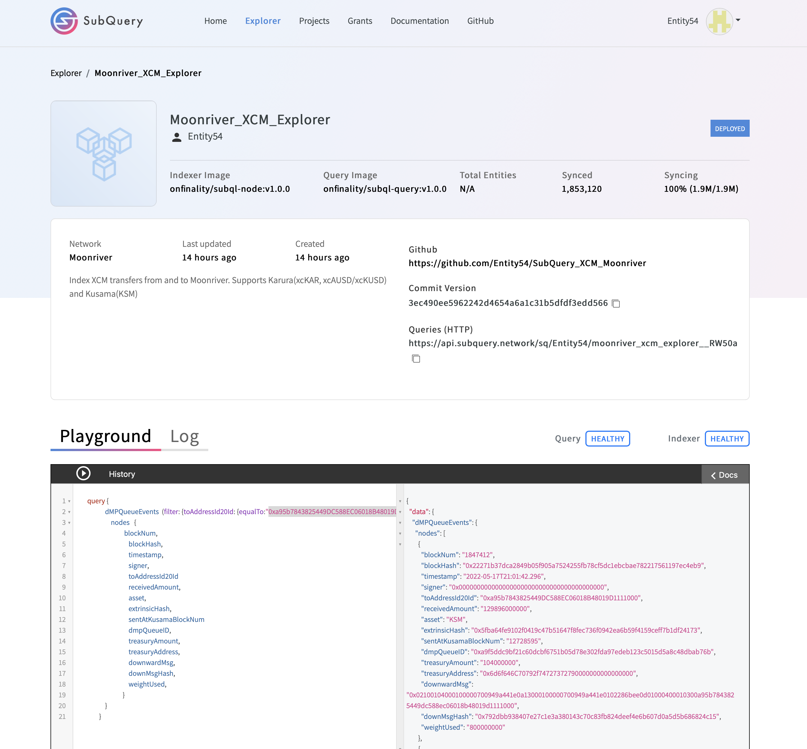
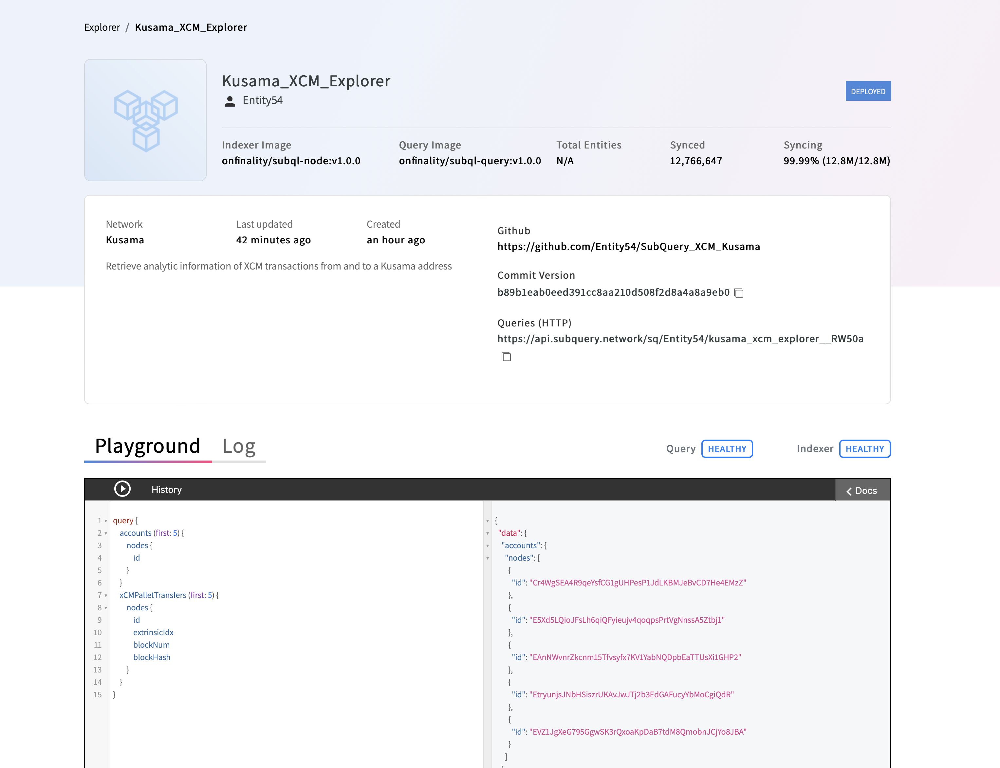

# MOONRIVER GRANT HACKATHON
APPLICABLE BOUNTIES

A> GRAND PRIZE  XCM CROSS-CHAIN EXPLORER

B> INDEXERS CORE BOUNTY (SUBQUERY)

      PUBLIC SUBQUERY PROJECTS
      1)  Karura    : https://explorer.subquery.network/subquery/Entity54/karura_xcm_explorer?stage=true
      2)  Moonriver : https://explorer.subquery.network/subquery/Entity54/moonriver_xcm_explorer?stage=true
      3)  Kusama    : https://api.subquery.network/sq/Entity54/kusama_xcm_explorer__RW50a

      Entity54 Github SubQuery Projects
      1) Karura    : https://github.com/Entity54/SubQuery_XCM_Karura
      2) Moonriver : https://github.com/Entity54/SubQuery_XCM_Moonriver
      3) Kusama    : https://github.com/Entity54/SubQuery_XCM_Kusama

# XCMonitor Project 

## Website
 

 https

 

## Video Link
 

 https://www.dropbox.com/sh/2jwe5gwfnqgp4w6/AAALomuK1fM9MzpIns2Lm5qpa?dl=0 

 

# XCM Transfer Center 

 
 
 
Within the XCM Transfer Center the user has the ability to transfer tokens between constituent Parachains and Relay Chains via the Cross Consensus Messing Format (XCM).
 
Two kinds of vertical message-passing transport protocols have been used in the project:

      UMP (Upward Message Passing): This allows parachains to send messages to their relay chain.
      DMP (Downward Message Passing): This allows the relay chain to pass messages down to one of its parachains.
      
In addition, the project has used:

      HMRP (Horizontal Relay-routed Message Passing): This allows the parachains to exchange messages with other 
      parachains on the same relay chain.
 

## STEP 1 - Select the token and fill in the amount
Firstly, the user has to select the token that they would like to transfer.
Current options are KSM, KAR and AUSD.
Once this is completed, the "Number of tokens to send" field, needs to be populated.
 
 

## STEP 2 - Select the origin chain
Next the user chooses the origin chain where the tokens currently reside.
Current options are Moonriver, Karura and Kusama.
 
 
Note that depending on the origin chain selection, the metamask or substrate account will be automatically populated as shown on the loaded metamask and polkadot extensions. 

The user can choose to change the selected account by either changing his account in the metamask extension or the polkadot dropdown button. 
 

## STEP 3 - Select the target chain and account
Finally, the target chain has to be chosen. 
Currently it is possible to send KAR and AUSD from Moonriver to Karura and vice versa
and KSM from Moonriver to Kusama and viceversa.
 
 

## STEP 4 - Submit the XCM transaction
Click the "SEND" button and the transaction will be submitted. 
 
 
 

# XCM EXPLORER
 

 
On the Explorer page the user can retrieve analytical inforamtion about the XCM transactions.

## STEP 1 - Choose chain
Select the chain of the account you are interested in to retrieve the information.
Currently supported chains are Moonriver, Karura and Kusama.
 
 

## STEP 2 - Select direction of transfer
By selecting "Outgoing" the withdrawals from the selected account and chain will be displayed. 
By selecting "Incoming" the deposits from the selected account and chain will be displayed.
 
 
 
## STEP 3 - Fill in account address  
Populate the field with the address that you wish to analyze.
 
 

## STEP 4 - Get data 
Click the "GET DATA" button and the relevant request will be sent to the SubQuery servers.
 
 

The response shows analytical information about the requested transactions 
For example now it is possible to see the block and timestamp of a past transaction, the sending and receiving account addresses, the amount of tokens and the destination chain. 
Much more information is also available such as Extrisnic Hash, XCM Message Hash, Treasury Fees etc.
 
 
 

# SUBQUERY SERVERS 

## SUBQUERY KARURA

 
 
 
 

## SUBQUERY MOONRIVER

 
 
 
 

## SUBQUERY KUSAMA

 
 
 
 

filter=`(filter: {fromAccountId20Id: {equalTo:"${account}"}})`;
query {
               xTokensTransferredMultiAssetsEvents  ${filter}  {
                  nodes   {
                              id,
                              blockNum,
                              blockHash,
                              timestamp,
                              extrinsicHash,
                              fromAccountId20Id,
                              transferredToken,
                              sentAmount,
                              toAccountId32Id,
                              treasuryFees,
                              treasuryAdress,
                              toChainName,
                              xcmpMessage,
                           }
               }
            }

 
         
query {
      xTokensTransferredEvents  ${filter}  {
         nodes   {
                     id,
                     blockNum,
                     blockHash,
                     timestamp,
                     extrinsicHash,
                     fromAccountId20Id,
                     transferredToken,
                     sentAmount,
                     toAccountId32Id,
                     treasuryFees,
                     treasuryAdress,
                  }
      }
   }

 
    
query {
      dMPQueueEvents  (filter: {toAddressId20Id: {equalTo:"${account}"}})  {
         nodes   {
                     blockNum,
                     blockHash,
                     timestamp,
                     signer,
                     toAddressId20Id 
                     receivedAmount,
                     asset,
                     extrinsicHash,
                     sentAtKusamaBlockNum
                     dmpQueueID,
                     treasuryAmount,
                     treasuryAddress,
                     downwardMsg,
                     downMsgHash,
                     weightUsed,
                  }
      }
   }

 
    
query {
      xcmpQueueEvents  (filter: {toAccountId32Id: {equalTo:"${account}"}})  {
         nodes   {
                     blockNum,
                     blockHash,
                     timestamp,
                     fromAccountId32,
                     toAccountId32Id,
                     netReceivedAmount,
                     token,
                     extrinsicHash,
                     treasuryFees,
                     treasuryAddress,
                     xcmHash,
                  }
      }
   }

