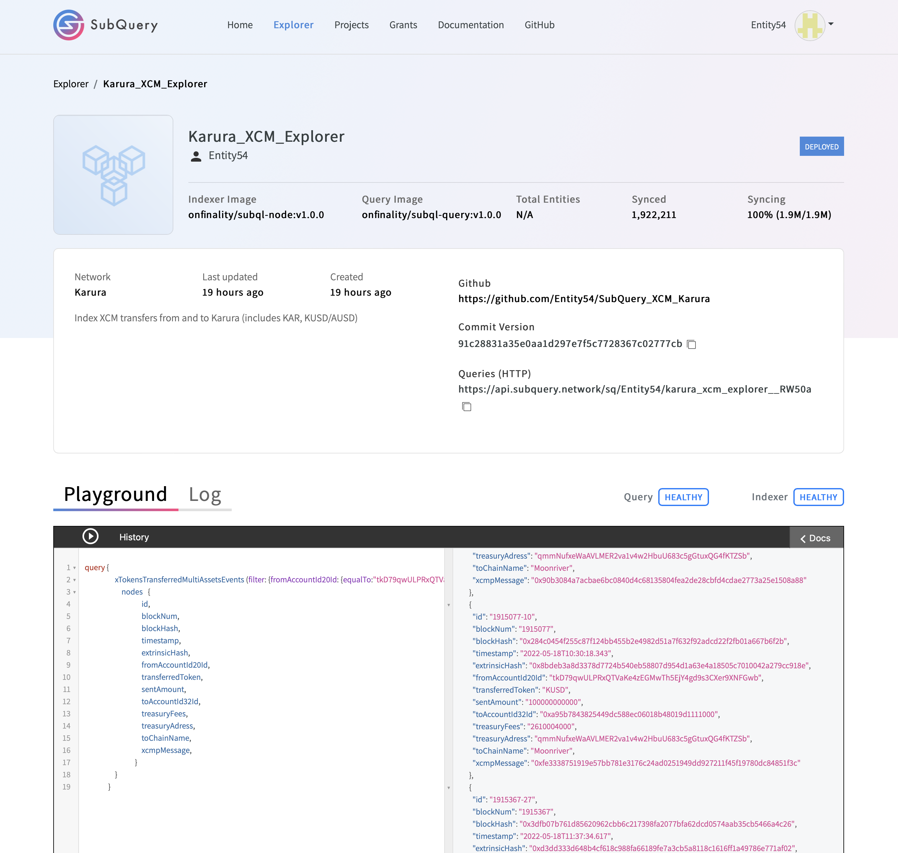

# MOONRIVER GRANT HACKATHON
APPLICABLE BOUNTIES

A> GRAND PRIZE  XCM CROSS-CHAIN EXPLORER

B> INDEXERS CORE BOUNTY (SUBQUERY)
PUBLIC SUBQUERY PROJECTS
1) https://explorer.subquery.network/subquery/Entity54/karura_xcm_explorer?stage=true
2) https://explorer.subquery.network/subquery/Entity54/moonriver_xcm_explorer?stage=true

## Website
 

 https

 

## Video Link
 

 https: 

 

## XCM TRANSFER CENTER 

 
 
 
The XCM Transfer Center allows the user to send a token from one chain to another. 
 

## STEP 1 Select Token and Fill in amount
Firstly, the user has to select the token that he wants to transfer.
Current options are KSM, KAR and AUSD
Following that the "Number of tokens to send" field, has to be filled
 
 

## STEP 2 Select Origin Chain
Next the user chooses the Origin chain that his tokens exist at the moment.
Current options are Moonriver, Karura and Kusama. 
 
 
Notice that depending on his selection of the Origin Chain the MetaMask or Substrate account will be prefilled as shown on the loaded MetMask and Polkadot extensions. 

The user can choose to change his selected account by either changing his account in MetaMask Extension or the Polkadot dropdown button. 
 

## STEP 3 Select Target Chain and Account
Finally, the Target chain has to be chosen 
Currently it is possible to send KAR and AUSD from Moonriver to Karura and vice versa
and KSM from Moonriver to Kusama and viceversa. 
 
 

## STEP 4 Submit XCM Transaction
Click the "SEND" button and the transaction is submitted. 
 
 
 

## XCM EXPLORER

 
In the Explorer page the user can retrieve analytical inforamtion about his XCM transactions

## STEP 1 Choose Chain
Select the chain of the account you are interested to retireve information about
Currently supported chains are Moonriver, Karura, Kusama  
 
 

## STEP 2 Select Direction of Transfer
 
 
By selecting Outgoing the withdrawals from the selected account and chain will be shown 
By selecting Incomig the deposits from the selected account and chain will be shown 
 
 
 
## STEP 3 Fill in Account address  
 
 
 

## STEP 4 Get Data 
Click the "GET DATA" and the relvevant request is sent to the SubQuery servers 

The response shows analytical information about the requested transactions 
For example now it is possible to see the block and timestamp of a past transaction, from which and to what account address, the amount of tokens and the destination parachain 
Many more information is available such as Extrisnic Hash, XCM Message Hash, Treeasury Fees etc.
 
 
 
 
 
 

## SUBQUERY SERVERS
 
 

## SUBQUERY KARURA

 
 
 
 

## SUBQUERY MOONRIVER

 
 
 
 
filter=`(filter: {fromAccountId20Id: {equalTo:"${account}"}})`;
query {
               xTokensTransferredMultiAssetsEvents  ${filter}  {
                  nodes   {
                              id,
                              blockNum,
                              blockHash,
                              timestamp,
                              extrinsicHash,
                              fromAccountId20Id,
                              transferredToken,
                              sentAmount,
                              toAccountId32Id,
                              treasuryFees,
                              treasuryAdress,
                              toChainName,
                              xcmpMessage,
                           }
               }
            }

 
         
query {
      xTokensTransferredEvents  ${filter}  {
         nodes   {
                     id,
                     blockNum,
                     blockHash,
                     timestamp,
                     extrinsicHash,
                     fromAccountId20Id,
                     transferredToken,
                     sentAmount,
                     toAccountId32Id,
                     treasuryFees,
                     treasuryAdress,
                  }
      }
   }

 
    
query {
      dMPQueueEvents  (filter: {toAddressId20Id: {equalTo:"${account}"}})  {
         nodes   {
                     blockNum,
                     blockHash,
                     timestamp,
                     signer,
                     toAddressId20Id 
                     receivedAmount,
                     asset,
                     extrinsicHash,
                     sentAtKusamaBlockNum
                     dmpQueueID,
                     treasuryAmount,
                     treasuryAddress,
                     downwardMsg,
                     downMsgHash,
                     weightUsed,
                  }
      }
   }

 
    
query {
      xcmpQueueEvents  (filter: {toAccountId32Id: {equalTo:"${account}"}})  {
         nodes   {
                     blockNum,
                     blockHash,
                     timestamp,
                     fromAccountId32,
                     toAccountId32Id,
                     netReceivedAmount,
                     token,
                     extrinsicHash,
                     treasuryFees,
                     treasuryAddress,
                     xcmHash,
                  }
      }
   }

